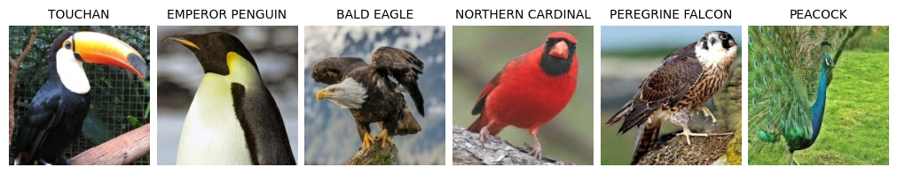
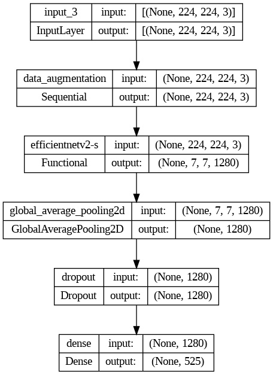

# BIRDS 525 SPECIES- IMAGE CLASSIFICATION

## 專案介紹
- 主程式：[main.ipynb](main.ipynb)
- 資料集：[BIRDS 525 SPECIES- IMAGE CLASSIFICATION](https://www.kaggle.com/datasets/gpiosenka/100-bird-species)
    
    - 訓練集路徑："./dataset/train"
    - 驗證集路徑："./dataset/valid"
    - 測試集路徑："./dataset/test"
- 任務：圖片分類
- 方法：使用EfficientNetV2預訓練模型進行遷移學習，設計並訓練下游任務的分類器模型。
- 準確度：94.51 %
- 模型架構：
    1. EfficientNetV2
        - Exclude Fully-Connected Layer at the top of the network.
        - Pretained on ImageNet
    2. Average Pooling Layer
    3. Dropout Layer
    4. Fully-Connected Layer

        
- 輸出檔案路徑：
    - 模型權重："./output/checkpoint"

## 環境部署

- 本專案的開發環境
    - 作業系統：Ubuntu 22.04.2 LTS
    - 套件與環境管理工具：[Miniconda](https://docs.conda.io/projects/miniconda/en/latest/)
    - Python版本：3.10.13
    - Tensorflow版本：2.15.0
        - CUDA Toolkit 12.2.1
        - cuDNN 8.9.4
    - Keras版本：2.15.0

- 環境安裝指令

    ```sh
        conda env create -n venv -f environment.yml 
    ```